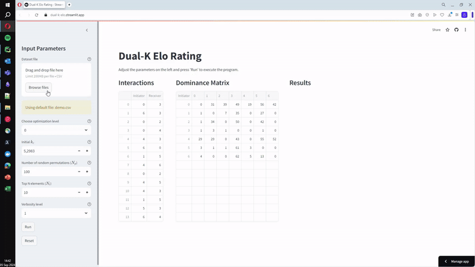

# Dual Elo Rating

**[Abstract Here]**

## Repository Structure

### 1. Dual Elo Rating

This folder contains:

- **Source Code**: The C++ implementation of the Dual Elo Elo rating.
- **Compiled Binaries**: Pre-compiled binaries for both Linux and Windows systems.

> If you wish to use the Dual Elo Elo rating, you can either compile the source code yourself or use the provided binaries.

### 2. DomArchive

This folder includes:

- **Publicly Available Datasets**: Sourced from the [DomArchive](https://github.com/DomArchive/DomArchive) repository.
- **Dual Elo Rating Results**: Results of applying the Dual Elo rating system to these datasets.

### 3. Simulation

This folder provides:

- **Python Code**: Scripts to generate simulated data.
- **Dual Elo Rating Results**: Results generated from the simulated data using the Dual-K Elo rating.
- **Plotting Scripts**: Code to generate the plots that are used in the paper.

## Demo

You can try out the Dual Elo system via our online demo: [Dual Elo Demo](https://dual-k-elo.streamlit.app).
Please note that, the demo does not come with any uptime or performance guarantee. For the best performance, we recommend compiling the source code provided in this repository.

## Cite This Work

**[Citation Here]**

## License

This code is licensed under the [GNU General Public License v3.0](https://www.gnu.org/licenses/gpl-3.0.html).
